# Kurikulum Belajar Go (Pemula sampai Mahir) + Struktur Folder

## Struktur folder yang diusulkan

Struktur mengikuti pola Anda: **nomor-tingkat** / **nama-topik** (satu folder per konsep, masing-masing bisa berisi `main.go` + materi).

```text
belajar-golang/
├── go.mod
├── 01-dasar/
│   ├── hello-world/
│   ├── variabel/
│   ├── constant/
│   ├── tipe-data-primitif/
│   ├── type-declaration/
│   ├── konversi-tipe/
│   └── operator/
│       ├── aritmatika/
│       ├── perbandingan/
│       └── boolean/
├── 02-alur-program/
│   ├── if-else/
│   ├── switch/
│   ├── for-loop/
│   ├── break-continue/
│   └── defer/
├── 03-koleksi-data/
│   ├── array/
│   ├── slice/
│   ├── map/
│   └── string-manipulation/
├── 04-fungsi/
│   ├── fungsi-dasar/
│   ├── parameter-dan-return/
│   ├── multiple-return/
│   ├── named-return/
│   ├── variadic-function/
│   ├── fungsi-sebagai-value/
│   ├── fungsi-sebagai-parameter/
│   └── anonymous-function-closure/
├── 05-struct-dan-method/
│   ├── struct-dasar/
│   ├── struct-embedding/
│   ├── method/
│   └── pointer-receiver/
├── 06-interface/
│   ├── interface-dasar/
│   ├── interface-kosong/
│   ├── type-assertion/
│   └── polymorphism/
├── 07-error-handling/
│   ├── error-dasar/
│   ├── custom-error/
│   ├── errors-join-wrap/
│   └── panic-recover/
├── 08-package-dan-modul/
│   ├── package-dasar/
│   ├── go-mod-init/
│   ├── import-alias/
│   └── visibility/
├── 09-concurrency-dasar/
│   ├── goroutine/
│   ├── channel/
│   ├── channel-buffered/
│   ├── select/
│   └── sync-waitgroup/
├── 10-concurrency-lanjutan/
│   ├── context/
│   ├── mutex/
│   ├── sync-once/
│   └── worker-pool-pattern/
├── 11-standard-library/
│   ├── fmt-io/
│   ├── strings-strconv/
│   ├── time/
│   ├── encoding-json/
│   ├── net-http/
│   └── os-file-path/
├── 12-testing-dan-tooling/
│   ├── unit-test/
│   ├── table-driven-test/
│   ├── benchmark/
│   ├── mock/
│   └── go-build-run-fmt-vet/
└── 13-lanjutan/
    ├── generics/
    ├── reflection/
    ├── unsafe/
    └── cgo-dasar/
```

---

## Daftar materi per level (urutan belajar)

### Level 1 — Dasar (01-dasar)


| #   | Topik                  | Yang dipelajari                                                                          |
| --- | ---------------------- | ---------------------------------------------------------------------------------------- |
| 1   | **Hello World**        | `main`, `package main`, `import`, `fmt.Println`, cara menjalankan `go run` / `go build`. |
| 2   | **Variabel**           | `var`, `:=`, short declaration, zero value, scope (block vs package).                    |
| 3   | **Konstanta**          | `const`, untyped vs typed constant, `iota`.                                              |
| 4   | **Tipe data primitif** | `int`/`int8`…/`uint`…, `float32`/`float64`, `bool`, `string`, `byte`/`rune`.             |
| 5   | **Type declaration**   | `type NamaTipe TipeDasar`, alias vs definisi tipe baru.                                  |
| 6   | **Konversi tipe**      | Konversi eksplisit (bukan casting), mis. `int(x)`, aturan aman.                          |
| 7   | **Operator**           | Aritmatika (`+ - * / %`), perbandingan (`== != < > <= >=`), boolean (`&&                 |


**Contoh isi folder:** Setiap subfolder punya satu (atau beberapa) file `main.go` yang fokus ke satu konsep.

---

### Level 2 — Alur program (02-alur-program)


| #   | Topik                | Yang dipelajari                                                                                |
| --- | -------------------- | ---------------------------------------------------------------------------------------------- |
| 1   | **if-else**          | `if`, `else`, `else if`, inisialisasi di `if` (`if x := ...; condition`).                      |
| 2   | **switch**           | `switch` nilai, `switch` tanpa nilai, `fallthrough`, `case` banyak nilai.                      |
| 3   | **for loop**         | Satu bentuk `for` (seperti C), `for condition`, `for range` (nanti dipakai lagi di slice/map). |
| 4   | **break & continue** | Keluar loop, loncat iterasi; `break`/`continue` dengan label (optional).                       |
| 5   | **defer**            | Urutan eksekusi (LIFO), penggunaan umum (close file, unlock, dll).                             |


---

### Level 3 — Koleksi data (03-koleksi-data)


| #   | Topik                   | Yang dipelajari                                                                    |
| --- | ----------------------- | ---------------------------------------------------------------------------------- |
| 1   | **Array**               | `[n]T`, fixed size, nilai vs referensi saat assign.                                |
| 2   | **Slice**               | `[]T`, `make`, `append`, `copy`, slice dari array, capacity & length.              |
| 3   | **Map**                 | `map[K]V`, inisialisasi, pengecekan key, iterasi, delete.                          |
| 4   | **String manipulation** | `strings` (Contains, Split, Join, Replace, Trim), `strconv`, slice string vs byte. |


---

### Level 4 — Fungsi (04-fungsi)


| #   | Topik                            | Yang dipelajari                                               |
| --- | -------------------------------- | ------------------------------------------------------------- |
| 1   | **Fungsi dasar**                 | Deklarasi, pemanggilan, naming.                               |
| 2   | **Parameter dan return**         | Single/multiple parameter, single return.                     |
| 3   | **Multiple return**              | Return banyak nilai, idiomatik untuk error.                   |
| 4   | **Named return**                 | Named return values, bare return (hati-hati).                 |
| 5   | **Variadic function**            | `...T`, slice sebagai variadic.                               |
| 6   | **Fungsi sebagai value**         | Assign fungsi ke variabel, pass ke fungsi lain.               |
| 7   | **Fungsi sebagai parameter**     | Callback, higher-order function.                              |
| 8   | **Anonymous function & closure** | Lambda, closure (variabel di scope luar), penggunaan praktis. |


---

### Level 5 — Struct dan method (05-struct-dan-method)


| #   | Topik                | Yang dipelajari                                          |
| --- | -------------------- | -------------------------------------------------------- |
| 1   | **Struct dasar**     | Definisi, literal, field access, zero value.             |
| 2   | **Struct embedding** | Embedded struct, promotion field/method.                 |
| 3   | **Method**           | Receiver `(t T)`, pemanggilan.                           |
| 4   | **Pointer receiver** | `(t *T)`, kapan pakai value vs pointer receiver, mutasi. |


---

### Level 6 — Interface (06-interface)


| #   | Topik                 | Yang dipelajari                                                   |
| --- | --------------------- | ----------------------------------------------------------------- |
| 1   | **Interface dasar**   | Definisi interface, implementasi implisit (no `implements`).      |
| 2   | **interface{} / any** | Empty interface, penggunaan umum (JSON, generic sebelum Go 1.18). |
| 3   | **Type assertion**    | `x.(T)`, comma-ok, switch on type.                                |
| 4   | **Polymorphism**      | Satu interface, banyak tipe konkret; design by contract.          |


---

### Level 7 — Error handling (07-error-handling)


| #   | Topik                  | Yang dipelajari                                                                  |
| --- | ---------------------- | -------------------------------------------------------------------------------- |
| 1   | **Error dasar**        | Tipe `error`, `errors.New`, `fmt.Errorf`, pengecekan error, idiom if err != nil. |
| 2   | **Custom error**       | Struct implement `error()`, sentinel error.                                      |
| 3   | **errors.Join & wrap** | `fmt.Errorf("%w", err)`, `errors.Unwrap`, `errors.Is`, `errors.As`.              |
| 4   | **panic & recover**    | Kapan panic, `recover()` di defer, kapan boleh dipakai.                          |


---

### Level 8 — Package dan modul (08-package-dan-modul)


| #   | Topik             | Yang dipelajari                                            |
| --- | ----------------- | ---------------------------------------------------------- |
| 1   | **Package dasar** | Satu package per folder, `package nama`.                   |
| 2   | **go mod**        | `go mod init`, `go get`, `go mod tidy`, `replace` (local). |
| 3   | **Import alias**  | Alias import, dot import (hindari).                        |
| 4   | **Visibility**    | Huruf besar = exported, huruf kecil = unexported.          |


---

### Level 9 — Concurrency dasar (09-concurrency-dasar)


| #   | Topik                | Yang dipelajari                                      |
| --- | -------------------- | ---------------------------------------------------- |
| 1   | **Goroutine**        | `go f()`, model concurrency Go, bukan OS thread 1:1. |
| 2   | **Channel**          | `chan T`, send/receive, blocking, close.             |
| 3   | **Channel buffered** | Buffered channel, select buffer size.                |
| 4   | **select**           | Multiple channel, default, timeout pattern.          |
| 5   | **sync.WaitGroup**   | Menunggu N goroutine selesai.                        |


---

### Level 10 — Concurrency lanjutan (10-concurrency-lanjutan)


| #   | Topik           | Yang dipelajari                                              |
| --- | --------------- | ------------------------------------------------------------ |
| 1   | **context**     | `context.Context`, cancel, timeout, deadline, nilai (value). |
| 2   | **Mutex**       | `sync.Mutex`, Lock/Unlock, race condition.                   |
| 3   | **sync.Once**   | Inisialisasi sekali.                                         |
| 4   | **Worker pool** | N worker, channel job, pattern produksi-konsumsi.            |


---

### Level 11 — Standard library (11-standard-library)


| #   | Topik                 | Yang dipelajari                                            |
| --- | --------------------- | ---------------------------------------------------------- |
| 1   | **fmt & io**          | Print, Scan, Fprint, io.Reader/Writer.                     |
| 2   | **strings & strconv** | Manipulasi string dan konversi string–angka.               |
| 3   | **time**              | Time, Duration, parsing, format, ticker/timer.             |
| 4   | **encoding/json**     | Marshal/Unmarshal, tag struct, raw message.                |
| 5   | **net/http**          | Client (Get/Post), Server (Handler, mux), middleware idea. |
| 6   | **os, file, path**    | Baca/tulis file, path, environment.                        |


---

### Level 12 — Testing & tooling (12-testing-dan-tooling)


| #   | Topik                 | Yang dipelajari                                     |
| --- | --------------------- | --------------------------------------------------- |
| 1   | **Unit test**         | `*_test.go`, `testing`, `go test`, t.Run.           |
| 2   | **Table-driven test** | Slice of cases, loop test.                          |
| 3   | **Benchmark**         | `func BenchmarkX(b *testing.B)`, `go test -bench`.  |
| 4   | **Mock**              | Interface untuk dependency, inject mock.            |
| 5   | **Tooling**           | `go build`, `go run`, `go fmt`, `go vet`, `go mod`. |


---

### Level 13 — Lanjutan (13-lanjutan)


| #   | Topik          | Yang dipelajari                                                        |
| --- | -------------- | ---------------------------------------------------------------------- |
| 1   | **Generics**   | Type parameter, `[T any]`, constraint, penggunaan di slice/map/fungsi. |
| 2   | **Reflection** | `reflect.Type`, `reflect.Value`, batasan dan performa.                 |
| 3   | **unsafe**     | `unsafe.Pointer`, penggunaan sangat spesifik.                          |
| 4   | **cgo dasar**  | Memanggil C dari Go (overview, bukan wajib).                           |


---

## Ringkasan alur belajar

```mermaid
flowchart LR
  subgraph dasar [01 Dasar]
    A[Hello World]
    B[Variabel Tipe Operator]
  end
  subgraph alur [02 Alur]
    C[If Switch For Defer]
  end
  subgraph koleksi [03 Koleksi]
    D[Array Slice Map]
  end
  subgraph fungsi [04 Fungsi]
    E[Fungsi Closure]
  end
  subgraph oop [05-06 OOP]
    F[Struct Method]
    G[Interface]
  end
  subgraph robust [07-08 Robust]
    H[Error Package]
  end
  subgraph concurrency [09-10 Concurrency]
    I[Goroutine Channel]
    J[Context Mutex]
  end
  subgraph praktis [11-13 Praktis]
    K[Stdlib Test]
    L[Generics Reflection]
  end
  dasar --> alur --> koleksi --> fungsi --> oop --> robust --> concurrency --> praktis
```




---

## Rekomendasi implementasi

- **Satu topik = satu subfolder** dengan minimal satu `main.go` (atau satu package kecil) yang bisa dijalankan dengan `go run .` dari folder tersebut.
- `**go.mod`** satu di root `belajar-golang/` (seperti contoh Anda); semua folder di bawahnya part of the same module.
- Untuk topik yang sudah Anda punya di repo lain (mis. `variable`, `break-continue`, `anonymous-function`), bisa di-copy atau di-link ke subfolder yang sesuai di `belajar-golang/` agar semua materi terpusat.

Jika Anda setuju dengan urutan dan struktur ini, langkah berikutnya bisa: (1) buat skeleton folder + `go.mod`, dan (2) isi setiap subfolder dengan satu file `main.go` minimal (bisa bertahap per level). Jika ingin mengubah urutan level atau memecah topik (mis. operator jadi lebih banyak subfolder), bisa disesuaikan.